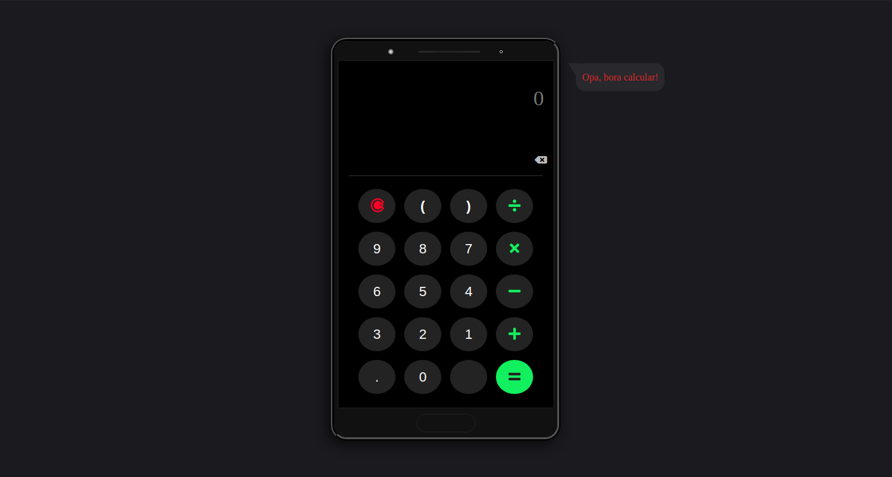

<h4 align="center">
	
</h4>

<p align="center">
 <a href="#-sobre-o-projeto">Sobre</a> •
 <a href="#-layout">Layout</a> • 
 <a href="#-como-executar-o-projeto">Como executar</a> • 
 <a href="#-tecnologias">Tecnologias</a> • 
 <a href="#-autor">Autor</a> • 
 <a href="#user-content--licença">Licença</a>
</p>


## 💻 Sobre o projeto

 Calculadora-web-js - basicamente uma calculadora web, contento as funcionalidade basicas de uma calculadora comum, com um diferencial no layout que apresenta uma device frame construido com CSS3.

---

## 🎨 Layout



---

## 🚀 Como executar o projeto

#### 🧭 Rodando a aplicação web na sua maquina

```bash

# Clone este repositório
$ git clone https://github.com/Diego-DevsS/calculadora-web-js

# Acesse a pasta do projeto no seu terminal/cmd
$ cd calculadora-web-js

# Abra arquivo principal na seu browser, ou atravez do comando
$ google-chrome index.html

```
ou penas click aqui para execultar a apliacação

[](https://calculadora-web-js.vercel.app/)
---

## 🛠 Tecnologias


#### **Utilitários**

-   Editor:  **[Visual Studio Code](https://code.visualstudio.com/)**

---

## 💪 Como contribuir para o projeto

1. Faça um **fork** do projeto.
2. Crie uma nova branch com as suas alterações: `git checkout -b my-feature`
3. Salve as alterações e crie uma mensagem de commit contando o que você fez: `git commit -m "feature: My new feature"`
4. Envie as suas alterações: `git push origin my-feature`
> Caso tenha alguma dúvida confira este [guia de como contribuir no GitHub](./CONTRIBUTING.md)

---

## 🦸 Autor

[](https://www.instagram.com/dcdevs/)
[](https://www.linkedin.com/in/diego-c-silva-487b171a5/)<br>
[](https://twitter.com/DiegoSi06829718)
[]()

---

## 📝 Licença

Este projeto esta sobe a licença [MIT](https://github.com/Diego-DevsS/calculadora-web-js/blob/main/LICENSE).

Feito por Diego Silva 💜

---
